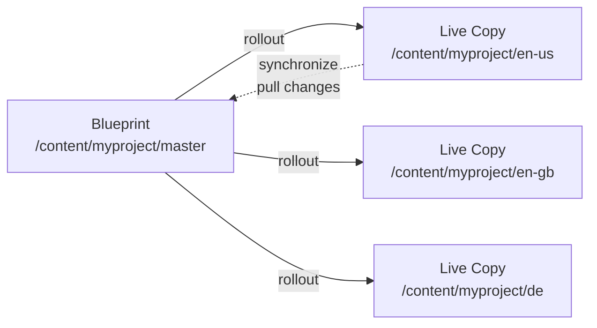
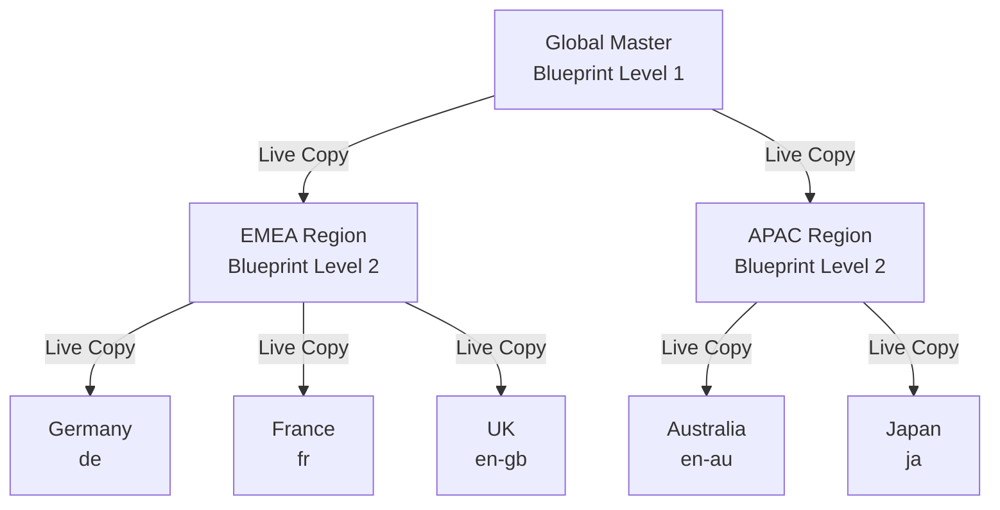
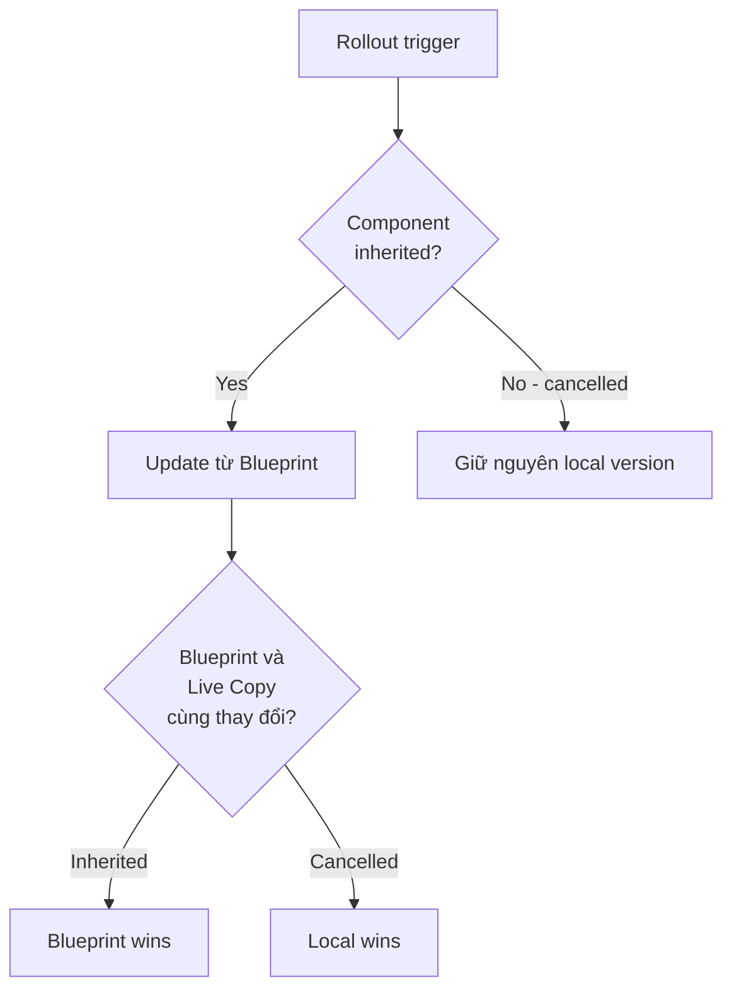

# Multi-Site Manager (MSM) — AEM 6.5 On-Premise

> Phạm vi: AEM 6.5 on-premise, Java 8/11

---

MSM cho phép quản lý nhiều website chia sẻ nội dung chung. Tạo **Blueprint** (nguồn) và derive **Live Copy** từ đó. Thay đổi trên Blueprint có thể tự động hoặc thủ công đẩy sang Live Copy qua **rollout**. Author trên Live Copy có thể override component bằng cách hủy inheritance.

MSM là nền tảng cho multi-language, multi-region, multi-brand sites.

---

## 1. Khái Niệm Cốt Lõi



### Blueprint

Blueprint là cây nội dung nguồn — master structure mà tất cả Live Copy kế thừa. Đăng ký Blueprint configuration để xuất hiện trong MSM UI:

```xml
<!-- apps/msm/myproject/blueprintconfigs/myproject-blueprint/.content.xml -->
<?xml version="1.0" encoding="UTF-8"?>
<jcr:root xmlns:jcr="http://www.jcp.org/jcr/1.0"
          xmlns:sling="http://sling.apache.org/jcr/sling/1.0"
          jcr:primaryType="cq:Page">
    <jcr:content
        jcr:primaryType="cq:PageContent"
        jcr:title="My Project Blueprint"
        sling:resourceType="msm/wcm/components/blueprint/configure"
        sitePath="/content/myproject/master"/>
</jcr:root>
```

Lưu tại `/apps/msm/myproject/blueprintconfigs/` (custom) hoặc `/libs/msm/wcm/blueprintconfigs/` (product).

### Live Copy

Live Copy là bản sao của Blueprint duy trì **live relationship** với source. Relationship được track qua `cq:LiveSyncConfig` trong JCR:

```
/content/myproject/en-gb/jcr:content
├── cq:LiveSyncConfig
│   ├── cq:master = "/content/myproject/master"
│   ├── cq:rolloutConfigs = ["/libs/msm/wcm/rolloutconfigs/default"]
│   └── cq:isDeep = true
```

### Rollout vs Synchronize

| | Rollout | Synchronize |
|---|---|---|
| Hướng | Blueprint → Live Copy | Blueprint → Live Copy |
| Khởi tạo từ | Blueprint page hoặc system event | Live Copy page |
| Khi nào dùng | Push thay đổi từ source | Pull thay đổi mới nhất |

Cả hai thực thi cùng rollout configuration actions — khác nhau ở nơi trigger.

### Inheritance

Mỗi component trên Live Copy page có 1 trong 2 trạng thái:

- **Inherited** (xanh): nội dung match Blueprint, rollout sẽ update component này
- **Cancelled** (vàng): author đã override, rollout bỏ qua component này
- **Re-enable**: reset component về phiên bản Blueprint (mất local changes)

---

## 2. Tạo Live Copy

### Qua UI

1. **Sites → Create → Live Copy**
2. Chọn source (Blueprint page/subtree)
3. Cấu hình destination path, site title
4. Chọn rollout configuration (hoặc dùng default)
5. Chọn include sub-pages (deep copy)

### Qua Java API

```java
package com.myproject.core.services;

import com.day.cq.wcm.api.WCMException;
import com.day.cq.wcm.msm.api.LiveRelationshipManager;
import com.day.cq.wcm.msm.api.RolloutConfig;
import org.apache.sling.api.resource.Resource;
import org.apache.sling.api.resource.ResourceResolver;
import org.osgi.service.component.annotations.Component;
import org.osgi.service.component.annotations.Reference;

@Component(service = LiveCopyService.class)
public class LiveCopyServiceImpl implements LiveCopyService {

    @Reference
    private LiveRelationshipManager liveRelationshipManager;

    @Override
    public void createLiveCopy(ResourceResolver resolver,
                               String blueprintPath,
                               String liveCopyPath,
                               String title) throws WCMException {

        Resource source = resolver.getResource(blueprintPath);
        if (source == null) {
            throw new WCMException("Blueprint not found: " + blueprintPath);
        }

        Resource targetParent = resolver.getResource(liveCopyPath);
        if (targetParent == null) {
            throw new WCMException("Target parent not found: " + liveCopyPath);
        }

        // null = dùng default rollout config
        RolloutConfig[] rolloutConfigs = null;

        liveRelationshipManager.create(
            source,            // Blueprint source
            targetParent,      // Parent của live copy mới
            title,             // Title
            true,              // deep — include sub-pages
            rolloutConfigs     // rollout configurations
        );

        resolver.commit();
    }
}
```

### Language Copy

MSM là cơ chế đằng sau language copy. Khi tạo qua **Sites → Create → Language Copy**, AEM tạo Live Copy với:

- Rollout configuration cho translation
- Integration với Translation Framework
- Property `jcr:language` trên language root

```
/content/myproject/
├── master/              ← Blueprint (source language, vd: English)
│   └── en/
├── de/                  ← Live Copy (German translation)
├── fr/                  ← Live Copy (French translation)
└── ja/                  ← Live Copy (Japanese translation)
```

---

## 3. Rollout Configurations

Rollout configuration định nghĩa **actions nào chạy** và **khi nào trigger**. Default config tại `/libs/msm/wcm/rolloutconfigs/default`.

### Built-in configurations

| Configuration | Path | Trigger | Actions |
|---|---|---|---|
| Standard Rollout | `/libs/.../rolloutconfigs/default` | `rollout` | contentUpdate, contentCopy, contentDelete, referencesUpdate, orderChildren |
| Activate on Blueprint Activation | `/libs/.../rolloutconfigs/activate` | `activate` | targetActivate |
| Deactivate on Blueprint Deactivation | `/libs/.../rolloutconfigs/deactivate` | `deactivate` | targetDeactivate |
| Push on Modify | `/libs/.../rolloutconfigs/pushonmodify` | `modification` | contentUpdate, contentCopy, contentDelete, orderChildren |

### Rollout triggers (`cq:trigger`)

| Trigger | Khi nào fire |
|---|---|
| `rollout` | Author trigger thủ công |
| `modification` | Blueprint page được lưu (save) |
| `activate` | Blueprint page được activate (publish) |
| `deactivate` | Blueprint page được deactivate |

### Built-in rollout actions

| Action | Chức năng |
|---|---|
| `contentUpdate` | Update nội dung Live Copy từ Blueprint |
| `contentCopy` | Copy nội dung mới từ Blueprint sang Live Copy |
| `contentDelete` | Xóa nội dung Live Copy nếu đã bị xóa trong Blueprint |
| `referencesUpdate` | Update internal references (links, images) trỏ sang Live Copy paths |
| `orderChildren` | Sync thứ tự child pages |
| `targetActivate` | Activate Live Copy page |
| `targetDeactivate` | Deactivate Live Copy page |
| `PageMoveAction` | Xử lý page moves từ Blueprint |

### Custom rollout configuration

```xml
<!-- apps/msm/myproject/rolloutconfigs/custom/.content.xml -->
<?xml version="1.0" encoding="UTF-8"?>
<jcr:root xmlns:jcr="http://www.jcp.org/jcr/1.0"
          xmlns:cq="http://www.day.com/jcr/cq/1.0"
          cq:trigger="rollout"
          jcr:primaryType="cq:RolloutConfig"
          jcr:title="My Custom Rollout Config"
          jcr:description="Standard rollout plus custom notification">
    <contentUpdate jcr:primaryType="cq:LiveSyncAction"/>
    <contentCopy jcr:primaryType="cq:LiveSyncAction"/>
    <contentDelete jcr:primaryType="cq:LiveSyncAction"/>
    <referencesUpdate jcr:primaryType="cq:LiveSyncAction"/>
    <orderChildren jcr:primaryType="cq:LiveSyncAction"/>
    <NotifyOnRollout jcr:primaryType="cq:LiveSyncAction"/>
</jcr:root>
```

Tên node (`NotifyOnRollout`) phải match `LiveActionFactory.LIVE_ACTION_NAME`.

### Thứ tự thực thi

Rollout configurations chạy theo thứ tự JCR node. Dùng `sling:OrderedFolder` để kiểm soát:

```xml
<!-- apps/msm/myproject/rolloutconfigs/.content.xml -->
<?xml version="1.0" encoding="UTF-8"?>
<jcr:root xmlns:jcr="http://www.jcp.org/jcr/1.0"
          xmlns:sling="http://sling.apache.org/jcr/sling/1.0"
          jcr:primaryType="sling:OrderedFolder"
          jcr:title="Rollout Configurations">
    <pageMove/>
    <default/>
    <custom/>
</jcr:root>
```

### Assign rollout config cho Live Copy

- **UI**: Page Properties → tab Live Copy
- **JCR**: set property `cq:rolloutConfigs` trên node `cq:LiveSyncConfig`

Có thể assign nhiều rollout configurations cho 1 Live Copy — chạy tuần tự.

---

## 4. Page Moves và Structural Changes

Standard Rollout Configuration **không xử lý page moves**. Đây là thiết kế có chủ đích — page move ngầm bao gồm delete, có thể gây hành vi không mong muốn trên publish.

Tạo rollout config riêng cho page moves:

```xml
<!-- apps/msm/myproject/rolloutconfigs/pageMove/.content.xml -->
<?xml version="1.0" encoding="UTF-8"?>
<jcr:root xmlns:jcr="http://www.jcp.org/jcr/1.0"
          xmlns:cq="http://www.day.com/jcr/cq/1.0"
          cq:trigger="rollout"
          jcr:primaryType="cq:RolloutConfig"
          jcr:title="PageMove Rollout Config"
          jcr:description="Handles page moves from Blueprint to Live Copy">
    <PageMoveAction jcr:primaryType="cq:LiveSyncAction"/>
</jcr:root>
```

`PageMoveAction` **copy** (không move) Live Copy page sang location mới. Page tại location cũ vẫn còn với relationship bị broken. Cần cleanup thủ công hoặc qua custom workflow.

---

## 5. Custom Rollout Action (Java)

```java
package com.myproject.core.msm;

import com.day.cq.wcm.api.WCMException;
import com.day.cq.wcm.msm.api.LiveAction;
import com.day.cq.wcm.msm.api.LiveActionFactory;
import com.day.cq.wcm.msm.api.LiveRelationship;
import org.apache.sling.api.resource.Resource;
import org.osgi.service.component.annotations.Component;
import org.osgi.service.component.annotations.Reference;
import org.slf4j.Logger;
import org.slf4j.LoggerFactory;

@Component(
    service = LiveActionFactory.class,
    immediate = true,
    property = {
        LiveActionFactory.LIVE_ACTION_NAME + "=" + NotificationRolloutActionFactory.ACTION_NAME
    }
)
public class NotificationRolloutActionFactory implements LiveActionFactory<LiveAction> {

    static final String ACTION_NAME = "NotifyOnRollout";
    private static final Logger LOG = LoggerFactory.getLogger(NotificationRolloutActionFactory.class);

    @Reference
    private NotificationService notificationService;

    @Override
    public String createsAction() {
        return ACTION_NAME;
    }

    @Override
    public LiveAction createAction(Resource resource) {
        return new NotifyAction(notificationService);
    }

    private static class NotifyAction implements LiveAction {

        private final NotificationService notificationService;

        NotifyAction(NotificationService notificationService) {
            this.notificationService = notificationService;
        }

        @Override
        public String getName() {
            return ACTION_NAME;
        }

        @Override
        public void execute(Resource source, Resource target,
                            LiveRelationship relation, boolean autoSave,
                            boolean isResetRollout) throws WCMException {
            if (source == null || target == null) {
                return;
            }

            String sourcePath = source.getPath();
            String targetPath = target.getPath();

            LOG.info("Rollout: {} -> {}", sourcePath, targetPath);

            try {
                notificationService.notifyRollout(sourcePath, targetPath, isResetRollout);
            } catch (Exception e) {
                LOG.error("Notification failed: {} -> {}", sourcePath, targetPath, e);
                // Không throw — notification failure không block rollout
            }
        }
    }
}
```

`LiveAction` **không phải** OSGi component — không dùng `@Reference` bên trong. Inject service vào factory, truyền qua constructor.

Đăng ký action trong rollout config XML:

```xml
<NotifyOnRollout jcr:primaryType="cq:LiveSyncAction"/>
```

---

## 6. MSM Java API

### LiveRelationshipManager

```java
@Reference
private LiveRelationshipManager liveRelationshipManager;
```

| Method | Chức năng |
|---|---|
| `create(source, parent, title, deep, configs)` | Tạo Live Copy mới |
| `getLiveRelationship(resource, advancedStatus)` | Lấy relationship cho 1 resource |
| `getLiveRelationships(source, path, deep)` | Lấy tất cả Live Copies của 1 Blueprint |
| `isSource(resource)` | Kiểm tra resource có phải Blueprint source |
| `endRelationship(resolver, relation, deep)` | Detach Live Copy khỏi Blueprint |
| `reenableRelationship(resolver, relation, deep)` | Re-enable inheritance |
| `cancelRelationship(resolver, relation, deep, triggerRollout)` | Hủy inheritance (local override) |

### Kiểm tra MSM status

```java
import com.day.cq.wcm.msm.api.LiveRelationship;
import com.day.cq.wcm.msm.api.LiveStatus;

public boolean isLiveCopy(Resource resource) throws WCMException {
    LiveRelationship rel = liveRelationshipManager
        .getLiveRelationship(resource, false);
    return rel != null;
}

public String getBlueprintPath(Resource liveCopyResource) throws WCMException {
    LiveRelationship rel = liveRelationshipManager
        .getLiveRelationship(liveCopyResource, false);
    if (rel != null) {
        LiveStatus status = rel.getStatus();
        if (status != null) {
            return status.getSourcePath();
        }
    }
    return null;
}
```

### Trigger rollout programmatically

```java
import com.day.cq.wcm.msm.api.RolloutManager;

@Reference
private RolloutManager rolloutManager;

public void rollout(ResourceResolver resolver, String blueprintPath, boolean deep)
        throws WCMException {

    Resource blueprint = resolver.getResource(blueprintPath);
    if (blueprint == null) {
        throw new WCMException("Blueprint not found: " + blueprintPath);
    }

    rolloutManager.rollout(resolver, blueprint, deep);
    resolver.commit();
}
```

### Cancel và re-enable inheritance

```java
// Cancel inheritance — component trở thành local override
LiveRelationship rel = liveRelationshipManager
    .getLiveRelationship(componentResource, false);

if (rel != null) {
    liveRelationshipManager.cancelRelationship(
        resolver, rel, false, false);
    resolver.commit();
}

// Re-enable inheritance — reset về Blueprint content (mất local changes)
liveRelationshipManager.reenableRelationship(resolver, rel, false);
resolver.commit();
```

### List tất cả Live Copies

```java
import javax.jcr.RangeIterator;
import java.util.ArrayList;
import java.util.Collections;
import java.util.List;

public List<String> getLiveCopyPaths(ResourceResolver resolver, String blueprintPath)
        throws WCMException {

    Resource blueprint = resolver.getResource(blueprintPath);
    if (blueprint == null) {
        return Collections.emptyList();
    }

    List<String> paths = new ArrayList<>();
    RangeIterator relationships = liveRelationshipManager
        .getLiveRelationships(blueprint, null, null);

    while (relationships.hasNext()) {
        LiveRelationship rel = (LiveRelationship) relationships.next();
        if (rel.getTargetPath() != null) {
            paths.add(rel.getTargetPath());
        }
    }

    return paths;
}
```

---

## 7. MSM trong Sling Model

Detect MSM context trong component — kiểm tra page hiện tại có phải Live Copy, inheritance đã bị hủy chưa:

```java
package com.myproject.core.models;

import com.day.cq.wcm.api.WCMException;
import com.day.cq.wcm.msm.api.LiveRelationship;
import com.day.cq.wcm.msm.api.LiveRelationshipManager;
import com.day.cq.wcm.msm.api.LiveStatus;
import org.apache.sling.api.SlingHttpServletRequest;
import org.apache.sling.api.resource.Resource;
import org.apache.sling.models.annotations.DefaultInjectionStrategy;
import org.apache.sling.models.annotations.Model;
import org.apache.sling.models.annotations.injectorspecific.OSGiService;
import org.apache.sling.models.annotations.injectorspecific.SlingObject;
import org.slf4j.Logger;
import org.slf4j.LoggerFactory;

import javax.annotation.PostConstruct;

@Model(adaptables = SlingHttpServletRequest.class,
       defaultInjectionStrategy = DefaultInjectionStrategy.OPTIONAL)
public class MsmAwareComponent {

    private static final Logger LOG = LoggerFactory.getLogger(MsmAwareComponent.class);

    @SlingObject
    private Resource resource;

    @OSGiService
    private LiveRelationshipManager liveRelationshipManager;

    private boolean liveCopy;
    private boolean inheritanceCancelled;
    private String blueprintPath;

    @PostConstruct
    protected void init() {
        try {
            LiveRelationship rel = liveRelationshipManager
                .getLiveRelationship(resource, true);

            if (rel != null) {
                liveCopy = true;
                LiveStatus status = rel.getStatus();
                if (status != null) {
                    blueprintPath = status.getSourcePath();
                    inheritanceCancelled = status.isCancelled();
                }
            }
        } catch (WCMException e) {
            LOG.debug("Cannot determine MSM status for {}", resource.getPath(), e);
        }
    }

    public boolean isLiveCopy()              { return liveCopy; }
    public boolean isInheritanceCancelled()   { return inheritanceCancelled; }
    public String getBlueprintPath()          { return blueprintPath; }
}
```

---

## 8. Groovy Console Scripts

### List tất cả Live Copies của Blueprint

```groovy
import com.day.cq.wcm.msm.api.LiveRelationshipManager

def lrm = sling.getService(LiveRelationshipManager)
def blueprintPath = '/content/myproject/master/en'
def blueprint = resourceResolver.getResource(blueprintPath)

if (blueprint == null) {
    out.println("Blueprint not found: ${blueprintPath}")
    return
}

def rels = lrm.getLiveRelationships(blueprint, null, null)
int count = 0
while (rels.hasNext()) {
    def rel = rels.next()
    out.println("Live Copy: ${rel.targetPath} -> Blueprint: ${rel.sourcePath}")
    count++
}

out.println("---")
out.println("Total: ${count} live copies")
```

### Kiểm tra inheritance status

```groovy
import com.day.cq.wcm.msm.api.LiveRelationshipManager

def lrm = sling.getService(LiveRelationshipManager)
def pagePath = '/content/myproject/en-gb/products'
def resource = resourceResolver.getResource(pagePath + '/jcr:content')

if (resource == null) {
    out.println("Resource not found")
    return
}

def rel = lrm.getLiveRelationship(resource, true)

if (rel != null) {
    def status = rel.status
    out.println("Is Live Copy: true")
    out.println("Source: ${status?.sourcePath}")
    out.println("Cancelled: ${status?.cancelled}")
    out.println("Last rolled out: ${status?.lastRolledOut}")
} else {
    out.println("Not a Live Copy")
}
```

### Force rollout subtree

```groovy
import com.day.cq.wcm.msm.api.RolloutManager

final boolean DRY_RUN = true

def rm = sling.getService(RolloutManager)
def blueprintPath = '/content/myproject/master/en/products'
def blueprint = resourceResolver.getResource(blueprintPath)

if (blueprint == null) {
    out.println("Blueprint not found: ${blueprintPath}")
    return
}

if (!DRY_RUN) {
    rm.rollout(resourceResolver, blueprint, true)
    out.println("Rolled out: ${blueprintPath} (deep)")
} else {
    out.println("DRY RUN — would roll out: ${blueprintPath} (deep)")
}
```

---

## 9. Multi-Site Architecture Patterns

### Pattern 1: Multi-region (cùng ngôn ngữ)

```
/content/myproject/
├── master/en/          ← Blueprint: Global English
├── en-us/              ← Live Copy: US English (pricing, legal riêng)
├── en-gb/              ← Live Copy: UK English (spelling, legal riêng)
└── en-au/              ← Live Copy: Australian English
```

Phù hợp: global brands có regional variations trong cùng ngôn ngữ.

### Pattern 2: Multi-language

```
/content/myproject/
├── en/                 ← Blueprint: English (source)
├── de/                 ← Live Copy + Translation: German
├── fr/                 ← Live Copy + Translation: French
└── vi/                 ← Live Copy + Translation: Vietnamese
```

Phù hợp: multilingual sites, cấu trúc giống nhau nhưng nội dung được dịch.

### Pattern 3: Multi-brand

```
/content/
├── brand-master/       ← Blueprint: shared structure + content
├── brand-a/            ← Live Copy: Brand A (theme, nội dung riêng)
├── brand-b/            ← Live Copy: Brand B
└── brand-c/            ← Live Copy: Brand C
```

Phù hợp: holding companies có nhiều brands chia sẻ core content.

### Pattern 4: Nested blueprints (multi-level)



Nested blueprints tăng độ phức tạp đáng kể. Rollout ở top level cascade qua intermediate levels. Test kỹ trước khi áp dụng.

---

## 10. Conflict Resolution



| Scenario | Hành vi |
|---|---|
| Inherited component, Blueprint updated | Live Copy component được update |
| Cancelled inheritance, Blueprint updated | Live Copy component **không** bị update |
| Component xóa trong Blueprint | Xóa trong Live Copy (nếu inherited) |
| Component mới trong Blueprint | Thêm vào Live Copy |
| Page xóa trong Blueprint | Xóa trong Live Copy |
| Page mới trong Blueprint | Thêm vào Live Copy |
| Cả hai side cùng thay đổi property | Blueprint wins cho inherited; local wins cho cancelled |

### Rollout Conflict Handler

Cấu hình tại **Tools → Operations → Web Console → Day CQ WCM Rollout Conflict Handler**. Default dùng chiến lược "Blueprint wins" cho inherited content.

---

## 11. Best Practices

### Giữ Blueprint sạch

- Blueprint content phải generic, reusable — không chứa nội dung region-specific
- Dùng content policies và Style System cho visual differences thay vì Live Copy override
- Thiết kế Blueprint là superset — Live Copy có thể ẩn pages không cần

### Giảm thiểu cancelled inheritance

- Mỗi cancelled inheritance = 1 component không nhận Blueprint updates nữa
- Ưu tiên design dialogs / template policies cho regional differences
- Track cancelled components qua **Live Copy Overview** trong Sites console

### Rollout strategy

- **Manual rollout** cho content thay đổi quan trọng cần review
- **Automatic triggers** (`modification`, `activate`) chỉ cho low-risk content (navigation, footer)
- Test rollout trên Author trước khi activate sang Publish
- Schedule large rollout vào thời điểm traffic thấp

### Naming và structure

- Naming nhất quán: `en-us`, `en-gb`, `de-de`
- Mirror Blueprint structure chính xác — divergence gây rollout không dự đoán được
- Document rollout configuration nào được assign cho Live Copy nào

---

## Pitfalls Thường Gặp

| Vấn đề | Giải pháp |
|---|---|
| Page moves không propagate | Tạo rollout config riêng với `PageMoveAction` |
| Rollout ghi đè local changes | Author phải cancel inheritance trên component cần giữ local |
| Live Copy relationship "Suspended" | Re-enable inheritance hoặc re-attach qua Sites console |
| Deep rollout chạy rất lâu | Giảm scope xuống pages/subtrees cụ thể; chạy full-site overnight |
| References trỏ về Blueprint paths | Đảm bảo `referencesUpdate` action có trong rollout config |
| Live Copy hiện content cũ | Kiểm tra rollout đã trigger chưa; synchronize từ Live Copy page |
| Nested blueprints cascade bất ngờ | Test multi-level rollout trên staging trước |
| Translation integration không hoạt động | Tạo language copy qua Sites → Create → Language Copy, không tạo thủ công |
| `cq:LiveSyncConfig` bị corrupt | Dùng Groovy Console check relationship status, detach và re-create nếu cần |
| Rollout config không có `referencesUpdate` | Internal links trên Live Copy sẽ trỏ về Blueprint — thêm action vào config |
| Author tạo page mới trên Live Copy rồi Blueprint rollout xóa | Page tạo thủ công trên Live Copy không có relationship → không bị xóa; nhưng cần awareness |

---

## Tham Khảo

- [MSM Best Practices (AEM 6.5)](https://experienceleague.adobe.com/en/docs/experience-manager-65/content/sites/administering/introduction/msm-best-practices) — Adobe Experience League
- [Live Copy Sync Configuration](https://experienceleague.adobe.com/en/docs/experience-manager-65/content/sites/administering/introduction/msm-sync) — Adobe Experience League
- [MSM Structure Changes and Rollouts](https://experienceleague.adobe.com/en/docs/experience-manager-65/content/sites/administering/introduction/msm-best-practices#structure-changes-and-rollouts) — Adobe Experience League
- [RolloutManager API (6.5 Javadoc)](https://developer.adobe.com/experience-manager/reference-materials/6-5/javadoc/com/day/cq/wcm/msm/api/RolloutManager.html)
- [LiveRelationshipManager API (6.5 Javadoc)](https://developer.adobe.com/experience-manager/reference-materials/6-5/javadoc/com/day/cq/wcm/msm/api/LiveRelationshipManager.html)
